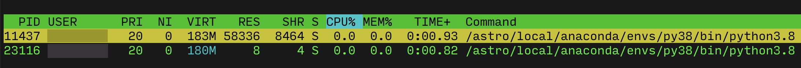

# Tunneling to Jupyter on remote host

Let's say we want to use port `8888` to make a tunnel to Jupyter running remotely on `beehive.uio.no`.

Just in case, check open local ports on your machine:

``` sh
$ netstat -anvp tcp | awk '{ if (($1 == "tcp4") && ($6 == "LISTEN")) { print $4 } }'
```

And verify that `8888` is available.

Then check open ports on `beehive.uio.no`:

``` sh
$ ssh -J login.uio.no beehive.uio.no
$ netstat -lntup | awk '{ if (($1 == "tcp") && ($6 == "LISTEN")) { print } }'
```

And also verify that `8888` is available.

Run Jupyter on remote host (*`beehive.uio.no`*):

``` sh
$ module list

$ which jupyter
/astro/local/anaconda/envs/py38/bin/jupyter

$ cd ~/code/rh/doc/notebooks/
$ jupyter lab --no-browser
```

If the `8888` port is available, then Jupyter should successfully bind to it. If this port is not available, then check if you already have Jupyter running:

``` sh
$ ps -u | grep jupyter
```

If you do, then either just use its port or kill the process and start a new one. You can also have Jupyter instances running from other users:



In that case you might need to run Jupyter on a different port.

Either way, having established that you have `8888` port available both on your machine and on remote host, make a tunnel like so:

``` sh
$ ssh -N -L 8888:localhost:8888 -J login.uio.no beehive.uio.no -v
```

And then you should be able to open http://localhost:8888 in your browser or connect to it from VS Code or any other Jupyter Notebook client.
